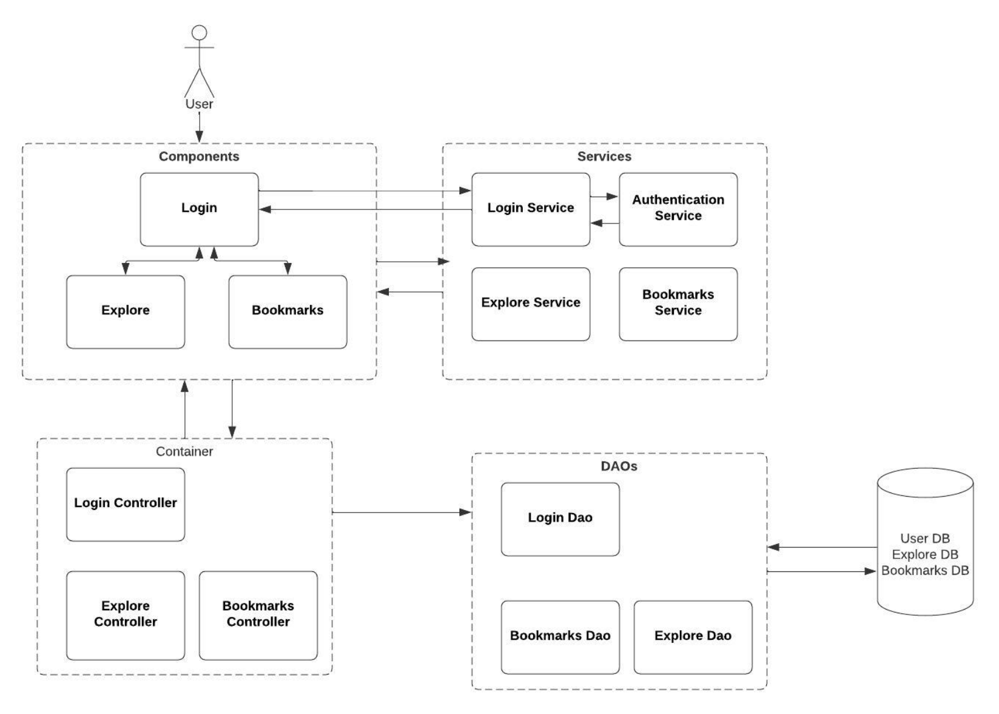

# Design

- Below is the high-level architecture diagram of the Tuiter application. 
- Here, a user can interact with the Tuiter application using the web interface. 
- To use the functionality of the Tuiter application, user needs to log in. 
- Only valid user who has previously registered with the application can log in. 
- Once the user enters his credentials, Login Service is invoked which internally invokes an internal authentication service to authenticate the user. 
- Once the user is authenticated he can use both the Explore or Bookmarks features. 
- If the user tries the Bookmarks feature, the UI of the Bookmarks features invokes its corresponding Bookmarks Service. 
- If the user bookmarks any of the tuit, this service internally invokes its controller which is responsible to store the bookmarked tuit into the DB using its corresponding DAO
- The flow for the explore screen is very much similar to the Bookmarks screen flow.

